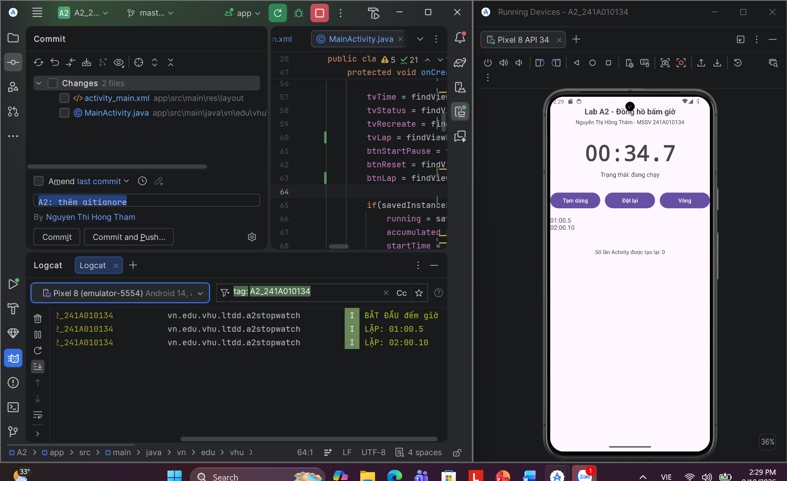
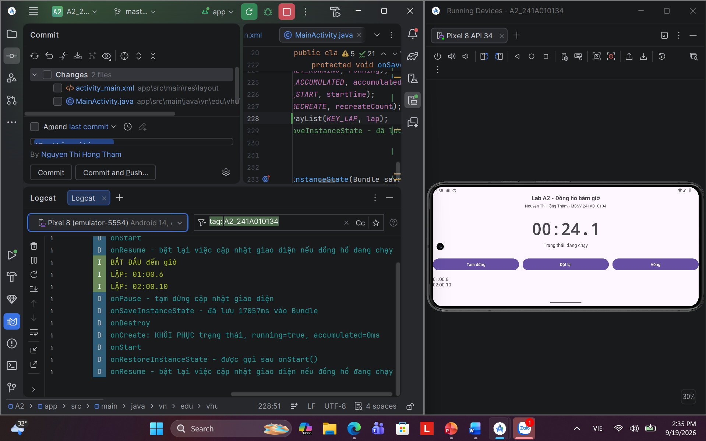
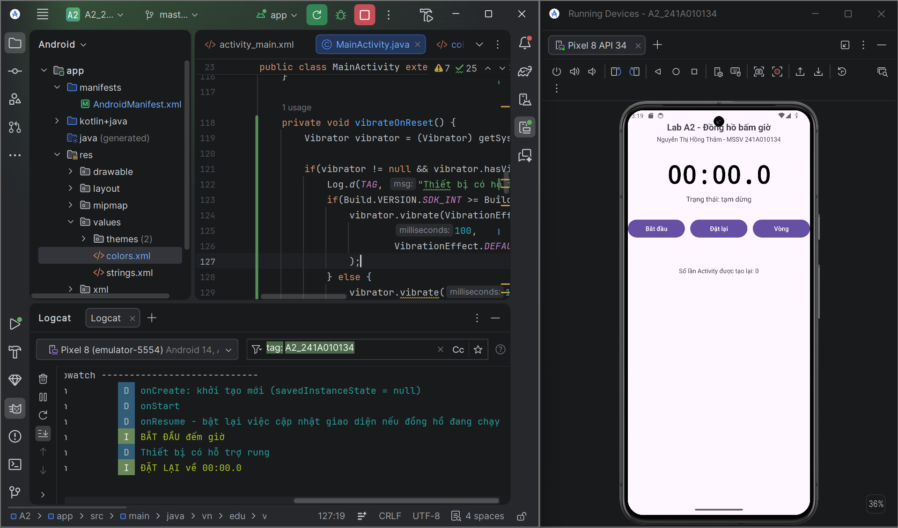

# A2 - Đồng hồ bấm giờ
## 1. Thông tin chung
### 1.1. Thông tin sinh viên
| Thông tin | Nội dung             |
|---|----------------------|
|Họ và tên| Nguyễn Thị Hồng Thắm |
|MSSV| 241A010134           |
|Lớp| CNTT - LTDD          |
### 1.2. Thông tin dự án
| Thông tin             | Nội dung                          |
|-----------------------|-----------------------------------|
| Tên dự án             | Đồng hồ bấm giờ                   |
| Package               | `vn.edu.vhu.ltdd.a2stopwatch`     |
| Ngôn ngữ / SDK tối thiểu | Java / API 24                     |
| Thiết bị              | Pixel 8 - API 34                  |
| Phiên bản Android     | 14 (API 34)                       |              |
| Phiên bản Android Studio | Android Studio Quail 4 - 2026.1.4 |                  

---

## 2. Giới thiệu

Lab A2 là bài thực hành xây dựng ứng dụng Android có tên là **Đồng hồ bấm giờ**:
- Tập trung vào xử lý vòng đời Activity bằng các **callback**
- Cập nhật giao diện định kỳ
- Lưu và khôi phục trạng thái khi Activity được tạo lại
- Thực hành quản lý project bằng Git và GitHub

Ứng dụng **Đồng hồ bấm giờ** được xây dựng bằng Java & XML Layout trên Android Studio

Ngoài ra, trong project còn thực hiện hai bài nâng cao tự chọn:
- NC1 - Nút Vòng (Lap)
- NC3 - Đổi màu con số đếm giờ khi vượt quá 60 giây và thêm phản hồi rung khi bấm nút **Đặt lại** trên máy ảo
## 3. Mục tiêu của Lab A2
- Viết mã xử lý đúng chỗ các **callback** trong vòng đời Activity gồm `onStart`, `onRestart`, `onResume`, `onPause`, `onStop`, `onDestroy`
- Cập nhật giao diện định kỳ bằng `Handler` - không làm treo giao diện
- Tính thời gian bằng mốc `SystemClock.elapsedRealtime()`
- Lưu và khôi phục trạng thái bằng `onSaveInstanceState()`
- Kiểm chứng sự khác nhau giữa Activity bị tạo lại và Activity được mở mới
- Thực hành Git, commit và push project lên GitHub
- Triển khai hai bài nâng cao tự chọn NC1 và NC3

## 4. Chức năng chính
### Đồng hồ bấm giờ
- **Bắt đầu** để đếm thời gian
- **Tạm dừng**
- **Đặt lại** thời gian đã đếm về `00:00.0`
- Hiển thị trạng thái hiện tại
- Hiển thị **Số lần Activity được tạo lại**

### Quản lý vòng đời
Ứng dụng ghi lại Logcat cho các **callback**:
- `onCreate`
- `onStart`
- `onResume`
- `onPause`
- `onStop`
- `onRestart`
- `onDestroy`
- `onSaveInstanceState`
- `onRestoreInstanceState`

### Lưu và khôi phục trạng thái
Khi Activity được tạo lại, ứng dụng sẽ khôi phục:
- Trạng thái **đang chạy / tạm dừng**
- Tổng thời gian đã tích lũy
- Mốc thời gian bắt đầu
- **Số lần Activity được tạo lại**
- Danh sach Lap của NC1

## 5. Cách đồng hồ hoạt động
Ứng dụng sử dụng 3 biến chính để tính thời gian:

| Biến          | Kiểu dữ liệu           | Ý nghĩa                                                           |
|---------------|------------------------|-------------------------------------------------------------------|
| `running`     | `boolean` (true/false) | Đồng hồ có đang chạy hay không                                    |
| `accumulated` | `long`                 | Tổng thời gian của các lần chạy trước                             |
| `startTime`   | `long`                 | Mốc `SystemClock.elapsedRealtime()` khi bắt đầu lần chạy hiện tại |

Thời gian được tính dựa trên mốc thời gian thay vì cộng thủ công sau mỗi lần `Handler` chạy
```java
private long elapsed() {
    if(!running) return accumulated;
    return accumulated + 
        (SystemClock.elapsedRealtime() - startTime);
}
```
`SystemClock.elapsedRealtime()` - giá trị không phụ thuộc vào việc người dùng thay đổi giờ hệ thống

## 6. Handler & Lifecycle & Bundle
### 6.1. Cập nhật giao diện bằng Handler

Ứng dụng sử dụng `Handler` kết hợp với `Runnable` để cập nhật thời gian định kỳ sau mỗi 100 ms
```java
private final Handler handler = new Handler(Looper.getMainLooper());

private final Runnable ticker = new Runnable() {
    @Override
    public void run() {
        updateTimeText();
        handler.postDelayed(this, 100);
    }
};
```

Hai hàm điều khiển việc cập nhật:
```java
private void startTicking() {
    handler.removeCallbacks(ticker);
    handler.post(ticker);
}

private void stopTicking() {
    handler.removeCallbacks(ticker);
}
```
`removeCallbacks(ticker)` giúp đồng hồ tránh khỏi trường hợp nhiều ticker chạy đồng thời khiến nó cập nhật nhiều lần ngoài ý muốn

Ngoài ra, việc `stopTicking()` được gọi trong hàm `onPause()` và `onDestroy()` để tránh việc Handler tiếp tục giữ tham chiếu đến Activity cũ
```java
protected void onPause() {
    super.onPause();
    stopTicking();
    Log.d(TAG, "onPause - tạm dừng cập nhật giao diện");
}
```
```java
protected void onDestroy() {
        stopTicking();
        Log.d(TAG, "onDestroy");
        super.onDestroy();
    }
```
### 6.2 Lifecycle - xử lý Activity thay đổi trạng thái
Ứng dụng theo dõi các **callback** chính của Activity để quan sát quá trình hoạt động: `onCreate()` > `onStart()` > `onResume()` > Activity đang tương tác với người dùng > `onPause()` > `onStop()`

Trong chương trình, các **callback**:
- `onCreate`: khởi tạo giao diện và kiểm tra xem có trạng thái cần khôi phục không
- `onStart` và `onResume`: ghi Logcat để quan sát vòng đời
- `onResume` gọi `startTicking()` nếu đồng hồ đang chạy
- `onPause` gọi `stopTicking()` để dừng việc cập nhật giao diện
- `onDestroy()` cũng gọi `stopTicking()` để đảm bảo không còn ticker của Activity cũ

Ví dụ:
```java
@Override
protected void onPause() {
    super.onPause();
    stopTicking();
    Log.d(TAG, "onPause - tạm dừng cập nhật giao diện");
}

@Override
protected void onResume() {
    super.onResume();
    
    if(running) {
        startTicking();
    }
    updateUi();
}
```
`stopTicking()` chỉ dừng việc cập nhật giao diện, không làm mất thời gian đã được đo trước đó

Thời gian thực tế vẫn được tính dựa trên: `SystemClock.elapsedRealtime();`
Do đó, khi Activity quay lại, chương trình có thể tính lại thời gian đã trôi qua dựa trên `startTime`

### 6.3. Bundle - lưu và khôi phục trạng thái
Khi Activity bị tạo lại (khi **xoay màn hình** hoặc bật **Don't keep activities), các biến trong Activity cũ có thể bị mất

Để giữ trạng thái cấn thiết, chương trình lưu dữ liệu vào `Bundle` trong `onSaveInstanceState()`:
```java
@Override
protected void onSaveInstanceState(Bundle outState) {
    super.onSaveInstanceState(outState);

    outState.putBoolean(KEY_RUNNING, running);
    outState.putLong(KEY_ACCUMULATED, accumulated);
    outState.putLong(KEY_START, startTime);
    outState.putInt(KEY_RECREATE, recreateCount);
}
```
| Dữ liệu         | Ý nghĩa                                  |
|-----------------|------------------------------------------|
| `running`       | Đồng hồ đang chạy hay đang tạm dừng      |
| `accumulated`   | Tổng thời gian của các lần chạy trước    |
| `startTime`     | Mốc thời gian bắt đầu lần chạy hiện tại  |
| `recreateCount` | Số lần Activity được tạo lại để quan sát |

Sau khi Activity được tạo lại, `onCreate()` kiểm tra `savedInstanceState`:
```java
protected void onCreate(Bundle savedInstanceState) {
    // |...|
    if (savedInstanceState != null) {
        running = savedInstanceState.getBoolean(KEY_RUNNING);
        accumulated = savedInstanceState.getLong(KEY_ACCUMULATED);
        startTime = savedInstanceState.getLong(KEY_START);
        recreateCount = savedInstanceState.getInt(KEY_RECREATE) + 1;
    }
}
```
Nếu `savedInstanceState == null`, chương trình sẽ hiểu rằng đây là lần khởi tạo mới và không có trạng thái cũ cần khôi phục

### Ba cơ chế phối hợp như sau
                 Activity đang chạy
                        │
                        ▼
                  Handler ticker
                        │
                        ▼
              cập nhật giao diện 100 ms/lần
                        │
                        │
          ┌─────────────┴─────────────┐
          │                           │
     Activity vẫn hoạt động       Activity tạm rời
          │                           │
          ▼                           ▼
    tiếp tục cập nhật             onPause()
                                      │
                                      ▼
                               stopTicking()
                                      │
                                      ▼
                         không cập nhật giao diện
                         nhưng trạng thái vẫn còn
                                      │
                                      ▼
                           Activity được tạo lại
                                      │
                                      ▼
                            onSaveInstanceState
                            → Bundle lưu trạng thái
                                      │
                                      ▼
                                  onCreate()
                                      │
                                      ▼
                         khôi phục trạng thái từ Bundle
                                      │
                                      ▼
                                  onResume()
                                      │
                                      ▼
                         startTicking() nếu đang chạy

Nhờ cách tổ chức này mà:
- **Handler** chịu trách nhiệm cập nhật giao diện định kỳ
- **Lifecycle** quyết định khi nào bắt đầu và khi nào dừng cập nhật
- **Bundle** giúp lưu và khôi phục trạng thái khi Activity bị tạo lại
- `elapsedRealtime()` & `startTime` giúp tính đúng thời gian thực tế kể cả khi giao diện tạm thời không được cập nhật
Nhờ vậy, đồng hồ vẫn giữ đúng thời gian sau khi xoay màn hình hoặc trong khi Activity bị hủy và tạo lại

## 7. Kịch bản kiểm thử
Project được kiểm tra theo 5 kịch bản sau:

| ST<br/>T | Thao tác                                           | Kết quả                                               |
|----------|----------------------------------------------------|-------------------------------------------------------|
| 1        | **Xoay màn hình** khi đồng hồ đang chạy            | Thời gian vẫn tiếp tục, không trở về 0                |
| 2        | Nhấn **Home**, chờ khoảng 10 giây rồi mở lại       | Thời gian được cộng thêm bình thường, không gián đoạn |
| 3        | Nhấn **Tạm dừng** rồi **xoay màn hình**            | Tạm dừng và vẫn giữ nguyên thời gian                  |
| 4        | Bật **Don't keep activities**, **Home** rồi mở lại | Activity được tạo lại và trạng thái được khôi phục    |
| 5        | Nhấn **Back** để thoát rồi mở lại                  | Ứng dụng bắt đầu lại từ đầu `00:00.0`                 |

## 8. Bài nâng cao
### 8.1. NC1 - Nút Vòng (Lap)
**YÊU CẦU**

Thêm nút `Vòng (Lap)` để lưu mốc thời gian hiện tại của đồng hồ và hiển thị các mốc thời gian đã lưu bên dưới chỉ số đếm

Danh sách Lap phải được giữ lại khi Activity được tạo lại, ví dụ: khi **xoay màn hình**

**THIẾT KẾ**

Danh sách Lap được lưu bằng:

```java
private ArrayList<String> laps = new ArrayList<String>();
```
Mỗi lần người dùng bấm nút `Vòng` thời gian hiện tại sẽ được lấy từ `elapsed()` và thêm vào danh sách

**THÊM LAP**

```java
private void addLap() {
    long ms = elapsed();
    long phut = ms / 60000;
    long giay = (ms % 60000) / 1000;
    long phanMuoi = (ms % 1000) / 100;

    String lapTime = String.format(Locale.getDefault(),
            "%02d:%02d.%d",
            laps.size() + 1,
            phut,
            giay,
            phanMuoi
    );
    laps.add(lapTime);
    updateLapText();

    Log.i(TAG, "LẶP: " + lapTime);
}
```

**HIỂN THỊ DANH SÁCH**

Sau khi thêm Lap, danh sách được cập nhật lên `TextView` và hiển thị Lap phía đưới đồng hồ

Ví dụ:

`01:00.05`

`02:00.12`

Trong đó:

`01` và `02` là thứ tự Vòng lặp, tức `Vòng 1` và `Vòng 2`

`00.05` và `00.12` là số thời gian được lưu khi bấn **Vòng**, tức Vòng 1: 5 giây và Vòng 2: 12 giây

**LƯU DANH SÁCH KHI ACTIVITY ĐƯỢC TẠO LẠI**

Trong `onSavedInstanceState()`:
```java
protected void onSaveInstanceState(Bundle outState) {
    super.onSaveInstanceState(outState);
    outState.putStringArrayList(KEY_LAPS, laps);
}
```
**KHÔI PHỤC DANH SÁCH**
Trong `onCreate()`:
```java
protected void onCreate(Bundle savedInstanceState) {
    super.onCreate(savedInstanceState);
    // |...|
    if (savedInstanceState != null) {
        running = savedInstanceState.getBoolean(KEY_RUNNING);
        accumulated = savedInstanceState.getLong(KEY_ACCUMULATED);
        startTime = savedInstanceState.getLong(KEY_START);
        recreateCount = savedInstanceState.getInt(KEY_RECREATE) + 1;
        laps = savedInstanceState.getStringArrayList(KEY_LAPS);
        if (laps == null) {
            laps = new ArrayList<>();
        }
        //|...|
    }
}
```
Sau khi khôi phục dữ liệu, danh sách Lap được cập nhật lại trên giao diện

**KẾT QUẢ KIỂM THỬ
- Thêm nhiều mốc Lap trong khi đồng hồ chạy
- Xoay màn hình
- Activity được tạo lại
- Các mốc Lap trước đó vẫn còn
- Thời gian của đồng hồ và danh sách vẫn được duy trì

`Ảnh minh chứng`:




### 8.2. NC3 - Đổi màu và thêm chức năng rung
**YÊU CẦU**

1. Đổi màu số thời gian khi vượt quá 60 giây
2. Tạo thêm chức năng rung khi người dùng nhấn **Đặt lại**

**ĐỔI MÀU KHI VƯỢT QUÁ 60 GIÂY**

Trong `updateTimeText()`, sau khi tính thời gian hiện tại ứng dựng sẽ kiểm tra số mili-giây (ms):

```java
 private void updateTimeText() {
    long ms = elapsed();

    long phut = ms / 60000;
    long giay = (ms % 60000) / 1000;
    long phanMuoi = (ms % 1000) / 100;

    tvTime.setText(String.format(
            Locale.getDefault(),
            "%02d:%02d.%d",
            phut,
            giay,
            phanMuoi
    ));

    if (ms > 60000) {
        tvTime.setTextColor(getColor(R.color.red));
    } else {
        tvTime.setTextColor(getColor(R.color.black));
    }
}
```
Màu đỏ được khai báo trong file `colors.xml`: `<color name ="red">#FFFF0000</color>`

Kết quả minh họa:
- `00:59.9`: màu mặc định
- `01:00.1`: chuyển sang màu đỏ

**KHAI BÁO QUYỀN RUNG**

Trong `AndroidManifest.xml`:

<uses-permission android:name="android.permission.VIBRATE" />

**XỬ LÝ RUNG**
Ứng dụng sử dụng `Vibrator` và `VibrationEffect`

```java
private void vibrateOnReset() {
        Vibrator vibrator = (Vibrator) getSystemService(VIBRATOR_SERVICE);

        if(vibrator != null && vibrator.hasVibrator()) {
            Log.d(TAG, "Thiết bị có hỗ trợ rung");
            if(Build.VERSION.SDK_INT >= Build.VERSION_CODES.O) {
                vibrator.vibrate(VibrationEffect.createOneShot(
                        100,
                        VibrationEffect.DEFAULT_AMPLITUDE)
                );
            } else {
                vibrator.vibrate(100);
            }
        } else {
            Log.d(TAG, "Không có Vibrator trên thiết bị");
        }
    }
```

**GỌI CHỨC NĂNG RUNG KHI ĐẶT LẠI**

Trong `resetStopwatch()`:

```java
private void resetStopwatch() {
    running = false;
    accumulated = 0L;
    startTime = 0L;
    
    stopTicking();
    vibrateOnReset();
    updateUi();
    
    Log.i(TAG, "ĐẶT LẠI về 00:00.0");
}
```

Mỗi lần nhấn **Đặt lại**, đồng hồ được đưa về `00:00.0` và hiệu ứng rung được thực hiện

Tuy nhiên, nếu dùng máy ảo trên Android Studio, không có hiệu ứng rung rõ ràng so với việc dùng máy thật, nên trong đoạn code sẽ có thông báo "Thiết bị có hỗ trợ rung" và "Không có Vibrator trên thiết bị" thay thế cho việc cảm nhận rung máy ảo

**KẾT QUẢ KIỂM THỬ**

**Kiểm tra đổi màu**
1. **Bắt đầu** đồng hồ
2. Chờ vượt quá 60 giây
3. Quan sát con số chuyển sang màu đỏ
**Kiểm tra rung**
1. Bấm `Đặt lại`
2. Ứng dụng kiểm tra thiết bị có hỗ trợ `Vibrator` hay không
3. Gọi hiệu ứng rung 100 ms
4. Logcat ghi: `Thiết bị có hỗ trợ rung` qua `ảnh minh chứng`:



## 9. Công nghệ sử dụng
- Java
- XML Layout
- Android Studio
- Android SDK
- `AppCompatActivity`
- `Handler`
- `Runnable`
- `SystemClock.elapsedRealtime()`
- `Bundle`
- `ArrayList<String>`
- `Vibrator`
- `VibrationEffect`
- Android Activity Lifecycle

## 10. Git & GitHub

Project được **quản lý** bằng Git và **lưu trữ** trên GitHub

Repository: `A2_241A010134`

### Quy trình
```text
Working Directory
       ↓ git add
Staging Area
       ↓ git commit
Local Repository
       ↓ git push
GitHub
```

Project có nhiều commit được chia theo từng giai đoạn phát triển

Một số commit chính:
- `Initial commit`
- `A2: them chuc nang lap`
- `A2: them gitignore`
- `A2: them doi mau va rung`

Repository sử dụng `.gitignore` để loại bỏ các file không cần commit, đặc biệt là `build/`, `.gradle`, `local.properties` và các file cấu hình IDE không cần thiết

## 11. Kết quả hoàn thành

### Chức năng cơ bản

- [x] Bắt đầu đồng hồ
- [x] Tạm dừng
- [x] Đặt lại
- [x] Cập nhật thời gian bằng Handler
- [x] Sử dụng `SystemClock.elapsedRealtime()`
- [x] Xử lý vòng đời Activity
- [x] Lưu trạng thái bằng `onSaveInstanceState()`
- [x] Khôi phục trạng thái khi Activity được tạo lại
- [x] Kiểm thử 5 kịch bản của Lab

### Bài nâng cao

- [x] NC1 - Nút Vòng (Lap)
- [x] Lưu danh sách Lap
- [x] Khôi phục danh sách Lap khi xoay màn hình
- [x] NC3 - Đổi màu khi vượt 60 giây
- [x] NC3 - Rung khi Đặt lại

### Git / GitHub

- [x] Git repository
- [x] GitHub repository
- [x] `.gitignore`
- [x] Nhiều commit
- [x] Push project lên GitHub
- [x] README

## 12. Repository

GitHub repository: https://github.com/HTham326/A2_241A010134